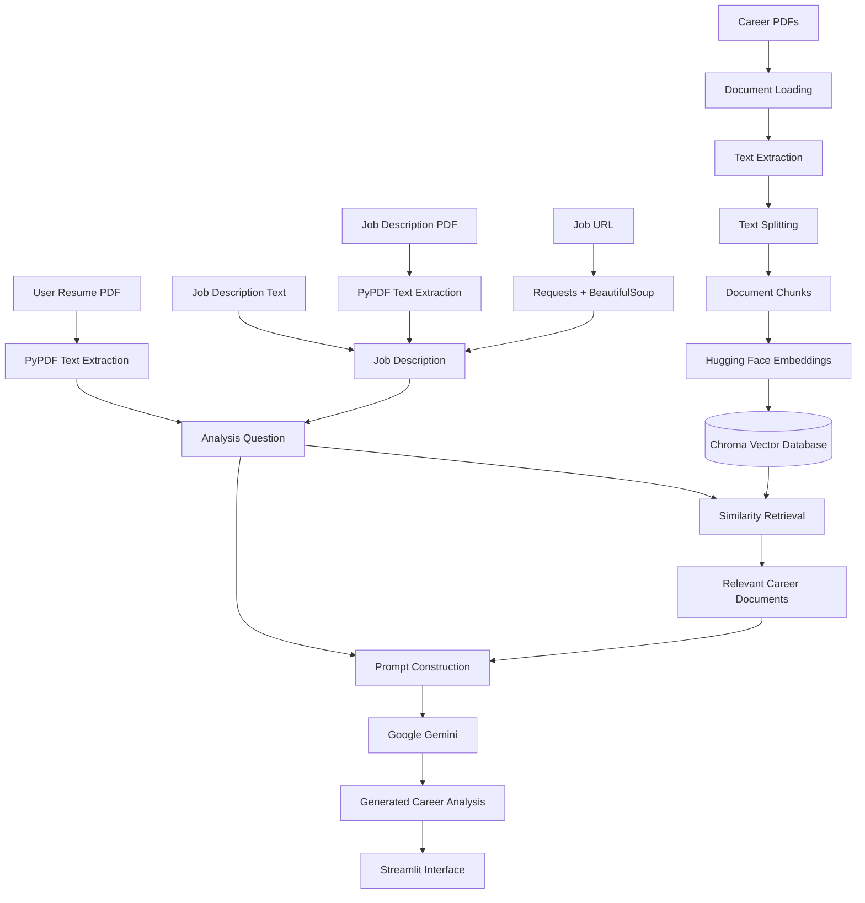

# Career RAG Assistant

An AI-powered **Career RAG Assistant** that combines **Retrieval-Augmented Generation (RAG)** with resume and job-description analysis to provide context-aware career insights.

The application allows users to upload a resume and compare it against a specific job description provided as text, PDF, or URL. Relevant information is retrieved from a career knowledge base and passed to **Google Gemini** to generate the analysis.

---

## Overview

The Career RAG Assistant combines:

* Resume analysis
* Job description analysis
* Semantic document retrieval
* Vector search
* Hugging Face embeddings
* Google Gemini
* Retrieval-Augmented Generation

The system uses a collection of career-related documents as its knowledge base.

When a user performs an analysis, the application:

1. Extracts text from the uploaded resume.
2. Accepts a job description through text, PDF, or URL.
3. Builds an analysis question containing the resume and job description.
4. Retrieves relevant information from the Chroma vector database.
5. Combines the retrieved context with the analysis prompt.
6. Sends the prompt to Google Gemini.
7. Displays the generated career analysis.

---

# Problem Statement

Job seekers often need to determine how well their resume aligns with a particular job description.

A simple keyword comparison may miss semantic relationships between skills, experience, technologies, and career requirements.

At the same time, general-purpose LLMs do not automatically use information from a user's custom career knowledge base.

The Career RAG Assistant addresses this by combining **resume/job comparison with a retrieval-based knowledge system**.

The goal is to provide more useful career analysis by grounding the LLM response in information retrieved from the project's career document collection.

---

# Objectives

The main objectives of the project are:

* Build a practical Retrieval-Augmented Generation application.
* Process career-related PDF documents.
* Create a semantic career knowledge base.
* Use vector similarity search to retrieve relevant information.
* Analyze a resume against a specific job description.
* Support job descriptions provided as text, PDF, or URL.
* Generate context-aware career insights using Google Gemini.
* Gain practical experience with LLMs, embeddings, vector databases, and RAG.

---

# Key Features

### 📄 Resume Upload

Upload a resume in PDF format for analysis.

### 💼 Job Description Input

Provide a job description using one of three methods:

* Paste job-description text
* Upload a job-description PDF
* Provide a job URL

### 🔎 Semantic Retrieval

The system uses vector similarity search to retrieve relevant information from the career knowledge base.

### 🧠 Retrieval-Augmented Generation

Retrieved document context is provided to Google Gemini before generating the final analysis.

### 📊 Career Match Analysis

The application is designed to analyze:

* Matching skills
* Skills not clearly demonstrated
* Experience alignment
* ATS-relevant observations
* Market alignment
* Overall match
* Recommended improvements

### 🌐 Job URL Extraction

For URL-based job descriptions, the application retrieves webpage content and extracts readable text using `Requests` and `BeautifulSoup`.

### 💬 Interactive Streamlit Interface

The application provides a dashboard-style interface for resume and job analysis.

---

# System Architecture

The project consists of two primary workflows:

## 1. Document Ingestion Pipeline

Career documents are processed before they can be used for retrieval.

```text
Career PDFs
     ↓
PDF Loader
     ↓
Text Extraction
     ↓
Text Splitting
     ↓
Document Chunks
     ↓
Hugging Face Embeddings
     ↓
Chroma Vector Database
```

## 2. Analysis Pipeline

When the user performs an analysis:

```text
Resume PDF
     ↓
Resume Text Extraction
     ↓
                ┌─────────────────────┐
Job Text/PDF/URL ──→ Job Description   │
                └─────────────────────┘
                         ↓
                  Analysis Question
                         ↓
                  Vector Retrieval
                         ↓
               Relevant Career Context
                         ↓
                 Prompt Construction
                         ↓
                  Google Gemini
                         ↓
                 Career Analysis
                         ↓
                  Streamlit UI
```

## Complete Architecture



---

# RAG Pipeline

## 1. Document Loading

Career-related PDF documents are loaded and processed during the ingestion stage.

The project uses LangChain-compatible document processing to prepare the documents for retrieval.

---

## 2. Text Splitting

Large documents are divided into smaller chunks.

Chunking allows the retrieval system to search smaller and more relevant sections rather than processing an entire document for every query.

```text
Large Document
      ↓
Chunk 1
Chunk 2
Chunk 3
Chunk 4
...
```

---

## 3. Embeddings

The project uses the Hugging Face embedding model:

```text
sentence-transformers/all-MiniLM-L6-v2
```

The embedding model converts text into numerical vector representations.

These vectors allow semantically similar pieces of text to be identified.

---

## 4. Chroma Vector Database

The generated embeddings are stored using **Chroma**.

The current project configuration uses:

```text
Database Directory: chroma_db
Collection: career_documents
```

The vector database is used to perform similarity searches during analysis.

---

## 5. Query Construction

The application combines the extracted resume and selected job description into an analysis question.

The question asks the system to evaluate:

```text
Matching skills
Skills not clearly demonstrated
Experience alignment
ATS-relevant observations
Market alignment
Overall match
Recommended improvements
```

---

## 6. Retrieval

The analysis question is sent to the retrieval system.

The project retrieves relevant documents from the Chroma vector database using semantic similarity search.

The current implementation retrieves documents associated with the configured knowledge-base sources.

---

## 7. Prompt Construction

The retrieved documents are converted into context containing:

* Source
* Page number
* Document content

This context is combined with the analysis question through the project's prompt-building function.

---

## 8. Response Generation

The final prompt is sent to:

```text
Google Gemini
gemini-3.6-flash
```

The model generates the final career analysis based on the provided question and retrieved context.

---

# Resume & Job Analysis Flow

### Resume

The user uploads a PDF resume.

The application extracts its text using `pypdf`.

```text
Resume PDF
    ↓
PdfReader
    ↓
Extracted Resume Text
```

### Job Description

The user can select one of three sources.

#### Text

The user directly pastes the job description.

#### PDF

The application extracts text from the uploaded job-description PDF.

#### URL

The application retrieves the webpage using `Requests` and extracts readable content using `BeautifulSoup`.

```text
Job URL
   ↓
Requests
   ↓
Webpage
   ↓
BeautifulSoup
   ↓
Cleaned Job Description
```

---

# Example Analysis

### User Input

**Resume:** PDF uploaded by the user

**Job Description:**

```text
Looking for a Machine Learning Engineer with
Python, SQL, PyTorch, machine learning and
data processing experience.
```

### Analysis Areas

The system evaluates:

* Matching skills
* Missing or unclear skills
* Experience alignment
* ATS considerations
* Market alignment
* Overall career match
* Recommended improvements

The final response is generated using retrieved career knowledge and Google Gemini.

---

# Tech Stack

| Technology           | Purpose                               |
| -------------------- | ------------------------------------- |
| **Python**           | Core application development          |
| **Streamlit**        | Interactive web interface             |
| **LangChain**        | RAG and document-processing framework |
| **PyPDF**            | Resume and PDF text extraction        |
| **Hugging Face**     | Text embeddings                       |
| **all-MiniLM-L6-v2** | Embedding model                       |
| **Chroma**           | Vector database                       |
| **Google Gemini**    | LLM-based response generation         |
| **Requests**         | Job webpage retrieval                 |
| **BeautifulSoup**    | Webpage text extraction               |
| **python-dotenv**    | Environment variable management       |
| **Git**              | Version control                       |
| **GitHub**           | Source-code hosting                   |

---

# Project Structure

```text
career-rag-assistant/
│
├── app.py
├── ingest.py
├── requirements.txt
├── README.md
├── .gitignore
├── .env.example
│
├── src/
│   ├── rag.py
│   └── prompts.py
│
└── chroma_db/
```

> `chroma_db/` is generated locally and should normally be excluded from GitHub using `.gitignore`.

### Important Files

| File               | Purpose                                                                 |
| ------------------ | ----------------------------------------------------------------------- |
| `app.py`           | Streamlit application and user interface                                |
| `ingest.py`        | Document ingestion and vector-database preparation                      |
| `src/rag.py`       | Embeddings, Chroma retrieval, Gemini integration, and answer generation |
| `src/prompts.py`   | Prompt construction                                                     |
| `requirements.txt` | Python dependencies                                                     |
| `.env.example`     | Example environment configuration                                       |
| `.gitignore`       | Prevents sensitive and generated files from being committed             |
| `README.md`        | Project documentation                                                   |

---

# Installation

## 1. Clone the Repository

```bash
git clone https://github.com/YOUR_USERNAME/career-rag-assistant.git
cd career-rag-assistant
```

---

## 2. Create a Virtual Environment

### Windows

```powershell
python -m venv venv
```

Activate it:

```powershell
venv\Scripts\activate
```

### macOS / Linux

```bash
python3 -m venv venv
source venv/bin/activate
```

---

## 3. Install Dependencies

```bash
pip install -r requirements.txt
```

---

# Environment Variables

Create a local `.env` file in the project root.

Use the following variable:

```env
GOOGLE_API_KEY=your_google_api_key_here
```

For the actual application, replace the placeholder with your own Google API key.

### `.env.example`

The repository should contain:

```env
GOOGLE_API_KEY=your_google_api_key_here
```

### Security

**Never commit `.env` or your real API key to GitHub.**

Your `.gitignore` should contain:

```gitignore
.env
.env.*
```

---

# Running the Project

## 1. Activate the Environment

Windows:

```powershell
venv\Scripts\activate
```

## 2. Build the Knowledge Base

Run the ingestion script:

```bash
python ingest.py
```

This processes the career documents and creates the local Chroma vector database.

## 3. Start the Streamlit Application

Run:

```bash
streamlit run app.py
```

Streamlit will provide the local URL for accessing the application.

---

# Data Flow

```text
                  DOCUMENT INGESTION
                         │
                         ▼
                  Career Documents
                         │
                         ▼
                  Document Loading
                         │
                         ▼
                   Text Splitting
                         │
                         ▼
             Hugging Face Embeddings
                         │
                         ▼
                  Chroma Database
                         │
                         │
                         │
                    USER ANALYSIS
                         │
                         ▼
                   Resume PDF
                         │
                         ▼
                  Resume Text
                         │
                         │
      ┌──────────────────┼──────────────────┐
      │                  │                  │
      ▼                  ▼                  ▼
 Job Text            Job PDF            Job URL
      │                  │                  │
      │              PDF Text        Web Extraction
      │                  │                  │
      └──────────────────┼──────────────────┘
                         ▼
                 Analysis Question
                         │
                         ▼
                  Similarity Search
                         │
                         ▼
               Relevant Career Context
                         │
                         ▼
                Prompt Construction
                         │
                         ▼
                   Google Gemini
                         │
                         ▼
                Career Match Analysis
                         │
                         ▼
                  Streamlit Interface
```

---

# Why RAG?

A standard LLM workflow can be represented as:

```text
User Question
      ↓
     LLM
      ↓
    Answer
```

The Career RAG Assistant adds a retrieval stage:

```text
User Question
      ↓
Retrieve Relevant Information
      ↓
Relevant Context
      ↓
Prompt + Context
      ↓
Google Gemini
      ↓
Career Analysis
```

This makes the system suitable for applications where responses should use information from a specific knowledge base.

RAG does not guarantee that every response will be correct. Retrieval quality, document quality, chunking, prompting, and model behavior all affect the final output.

---

# Use Cases

### Career Exploration

Explore career requirements and technology trends using the career knowledge base.

### Resume Analysis

Evaluate a resume against a specific job description.

### Skill Gap Identification

Identify skills that are missing or not clearly demonstrated in a resume.

### ATS-Oriented Analysis

Identify resume areas that may be relevant to Applicant Tracking Systems.

### Experience Alignment

Evaluate how the candidate's experience relates to the selected job.

### Career Improvement

Generate recommendations for improving alignment with a target role.

---

# Limitations

The current implementation has several limitations:

* The quality of analysis depends on the quality of the resume and job description.
* Retrieval quality depends on the documents available in the Chroma knowledge base.
* Poor chunking can reduce retrieval relevance.
* The LLM can still generate inaccurate information.
* Job URLs may not work correctly when websites use JavaScript-heavy rendering, authentication, or anti-bot protection.
* The current UI displays placeholder match metrics rather than calculating independent numerical scores.
* The uploaded resume is extracted and included in the analysis prompt, but it is **not currently embedded into Chroma during the analysis process**.
* Retrieval currently depends on the documents already present in the configured Chroma collection.

---

# Future Improvements

* [ ] Calculate actual resume-to-job match scores
* [ ] Add source citations to generated responses
* [ ] Display retrieved documents and page references
* [ ] Improve document chunking and retrieval
* [ ] Add resume embeddings to the analysis pipeline
* [ ] Add conversation memory
* [ ] Add user-specific career profiles
* [ ] Improve ATS analysis
* [ ] Add RAG evaluation metrics
* [ ] Measure retrieval relevance
* [ ] Improve hallucination control
* [ ] Support additional document formats
* [ ] Improve job URL extraction
* [ ] Add authentication
* [ ] Deploy the application

---

# Learning Outcomes

This project provides practical experience with:

* Retrieval-Augmented Generation
* Large Language Models
* Google Gemini
* Vector embeddings
* Hugging Face Sentence Transformers
* Chroma vector databases
* Semantic similarity search
* PDF processing
* Web content extraction
* LangChain
* Prompt engineering
* Streamlit
* API integration
* Environment-variable management
* Git and GitHub

---

# Project Status

🚧 **Under Development**

The core RAG pipeline, document retrieval system, Gemini integration, and resume/job analysis interface are implemented and being refined.

The next stage focuses on improving the accuracy of the matching system, adding measurable scoring, improving retrieval quality, and strengthening the user experience.

---

# Security

The following files and information should **never be committed** to the repository:

* API keys
* `.env`
* Passwords
* Private documents
* Personal information
* Virtual environments
* Generated vector databases
* Unnecessary model/cache files

Use `.env.example` to document required environment variables without exposing secrets.

---

# License

This project is developed for **educational and portfolio purposes**.
